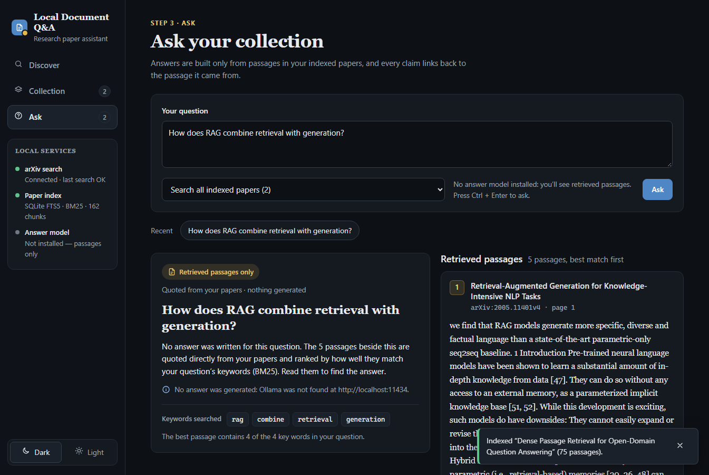
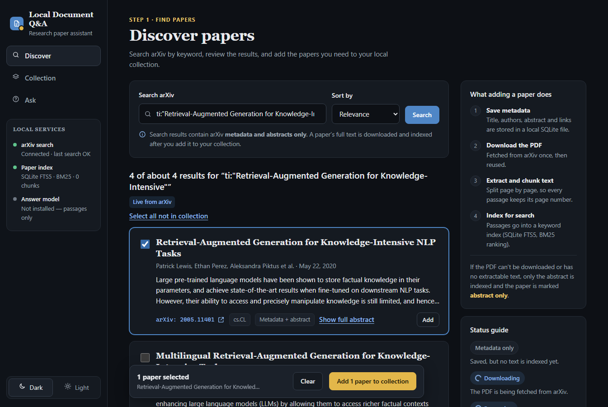
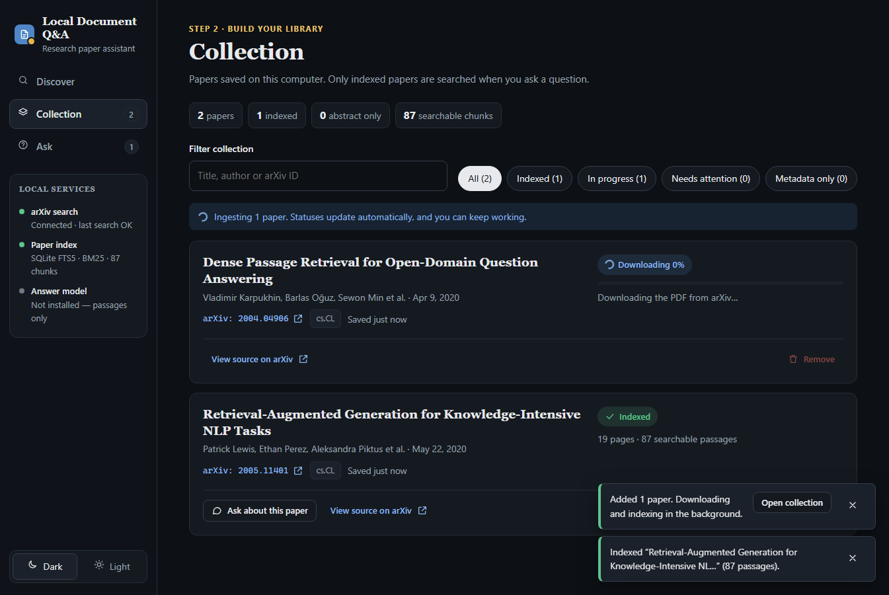
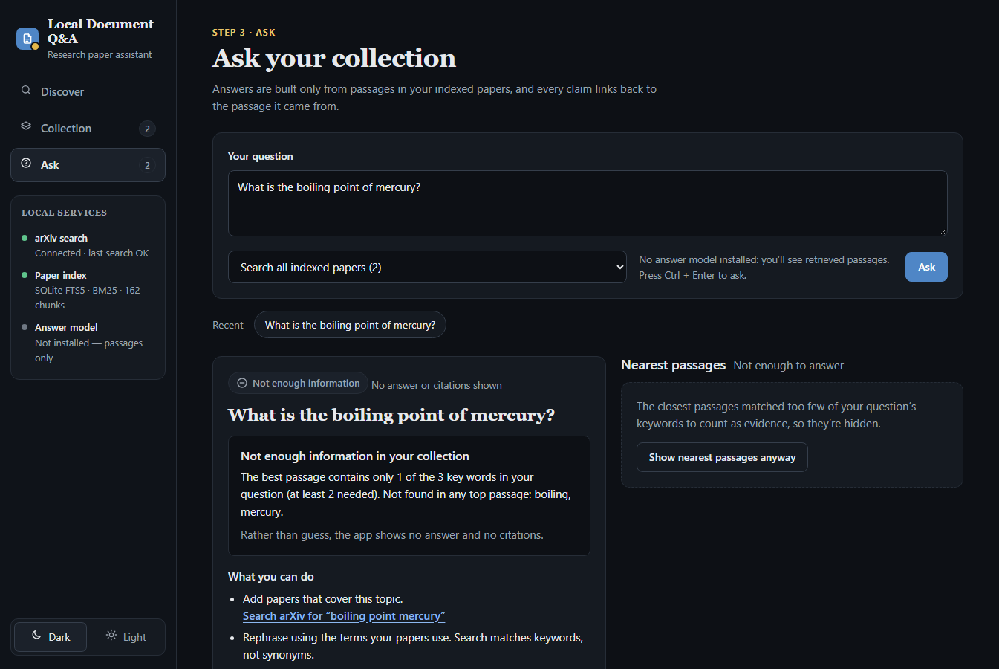
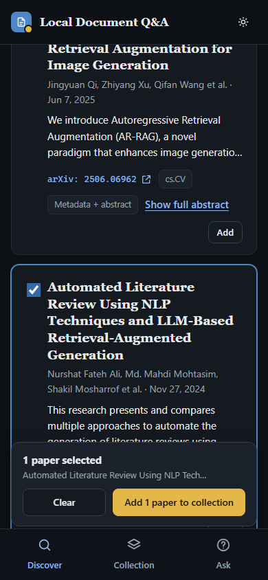
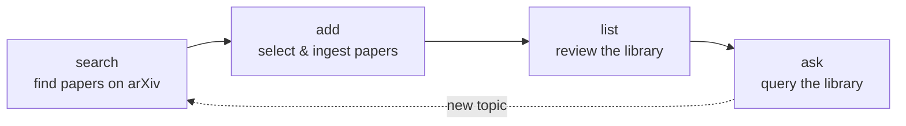
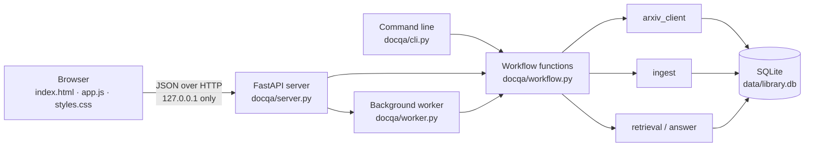
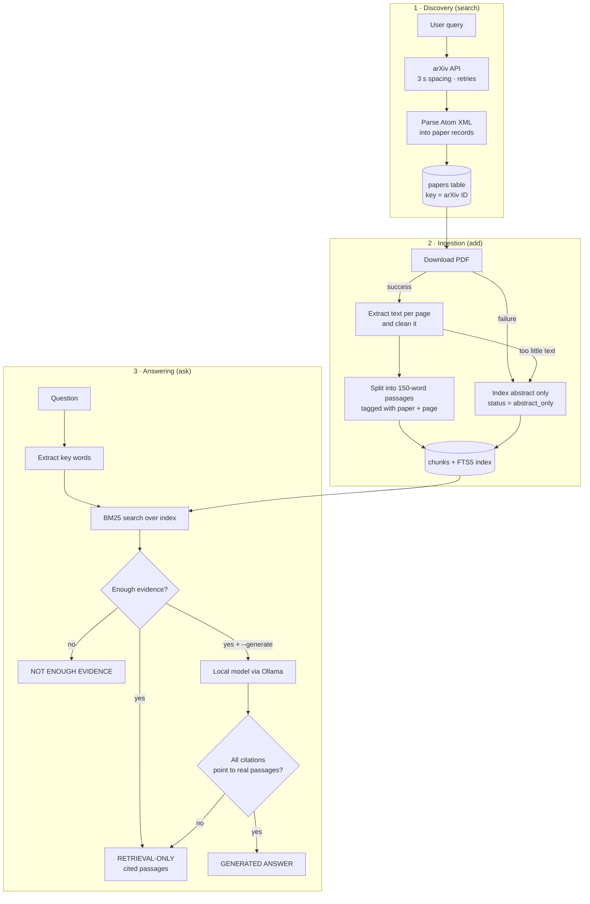

# local-document-qa

**A local, citation-first question-answering system for arXiv research papers.**

`local-document-qa` lets you search arXiv, select papers, and build a personal full-text library
on your own machine. You can then ask questions in plain English. The system returns the most
relevant passages, each cited to a specific paper and page. When the library does not contain
enough evidence, it says so instead of guessing.

It has two interfaces over the same engine: a **web interface** that runs locally in your browser
(`python app.py serve`) and a **command-line interface**. The project runs entirely on local,
free tools (Python 3.11, SQLite, pypdf, FastAPI) and needs no paid API, account, or cloud service.



---

## Table of contents

1. [Key features](#1-key-features)
2. [Quick start](#2-quick-start)
3. [Installation](#3-installation)
4. [Web interface](#4-web-interface)
5. [Command-line usage](#5-command-line-usage)
6. [Example session](#6-example-session)
7. [System architecture](#7-system-architecture)
8. [HTTP API](#8-http-api)
9. [Design decisions](#9-design-decisions)
10. [Data storage](#10-data-storage)
11. [Configuration](#11-configuration)
12. [Optional: generated answers with a local model](#12-optional-generated-answers-with-a-local-model)
13. [Testing](#13-testing)
14. [Evaluation](#14-evaluation)
15. [Limitations](#15-limitations)
16. [Troubleshooting](#16-troubleshooting)
17. [Project structure](#17-project-structure)
18. [Project history](#18-project-history)
19. [Public read-only demo](#19-public-read-only-demo)

---

## 1. Key features

| Capability | Description |
|---|---|
| **arXiv discovery** | Search by keywords, quoted phrases, or native arXiv syntax (`ti:`, `au:`, `cat:`, …). Supports pagination and sorting by relevance or submission date. |
| **Duplicate-safe local library** | Every paper is stored by its stable arXiv ID. Searching or adding the same paper twice updates it instead of duplicating it. |
| **Full-text ingestion** | Downloads the PDFs of selected papers, extracts and cleans the text page by page, and splits it into searchable passages. |
| **Honest fallback** | If a PDF cannot be downloaded or contains no extractable text, the paper is labelled `abstract_only` along with the reason. The system never claims to have read text it does not have. |
| **Page-level citations** | Every passage records its paper ID, version, and page number, and links directly to that page of the PDF. |
| **Persistent search index** | A full-text index (SQLite FTS5, BM25 ranking) is stored on disk and reused across sessions, so nothing is downloaded or re-indexed on restart. |
| **Evidence check** | Questions the library cannot support get an explicit **NOT ENOUGH EVIDENCE** result. |
| **Retrieval-only by default** | Output is clearly labelled as retrieved passages, never presented as a generated answer. |
| **Optional local answer generation** | With [Ollama](https://ollama.com), a local model can write an answer. The answer is accepted only if every citation refers to a passage that was actually retrieved. |
| **Local web interface** | Discover, Collection and Ask screens with live ingestion progress, filters, removal, dark/light themes, and a phone layout. Served only to your own computer. |
| **Background ingestion** | Papers are downloaded and indexed one at a time in the background with real download progress; ingestion interrupted by closing the app is marked for retry on restart. |
| **Tested and evaluated** | 205 automated tests, including 14 browser end-to-end tests of every screen and the read-only demo (no network access required), and a 25-question retrieval evaluation with published results, including failures. |

---

## 2. Quick start

```powershell
git clone https://github.com/vAliveruSH/local-document-qa.git
cd local-document-qa
py -3.11 -m venv .venv
.\.venv\Scripts\Activate.ps1
python -m pip install -r requirements-dev.txt

# Web interface: opens http://127.0.0.1:8000 in your browser
python app.py serve

# ...or the command line
python app.py search "retrieval augmented generation" --max 5
python app.py add 2005.11401
python app.py ask "Which Wikipedia dump is used as the knowledge source?"
```

---

## 3. Installation

### 3.1 Prerequisites

| Requirement | Version | Notes |
|---|---|---|
| Windows | 10 or 11 | The commands below use PowerShell. The code itself is platform-independent. |
| Python | 3.11 | Check with `py -3.11 --version`. |
| Git | any recent | Needed to clone the repository. |
| Internet access | — | Needed only for searching and adding papers. Asking works offline. |
| A web browser | any modern | For the web interface (Chrome, Edge, Firefox). |

### 3.2 Set up a virtual environment

A virtual environment keeps this project's packages separate from the rest of your system.

```powershell
cd local-document-qa
py -3.11 -m venv .venv
.\.venv\Scripts\Activate.ps1
```

> If PowerShell reports that *running scripts is disabled*, run
> `Set-ExecutionPolicy -Scope CurrentUser RemoteSigned` once. Alternatively, skip activation and
> replace `python` with `.\.venv\Scripts\python.exe` in every command.

### 3.3 Install dependencies

```powershell
python -m pip install -r requirements-dev.txt   # app + test runner
# or, to run the app without tests:
python -m pip install -r requirements.txt
```

| Package | Purpose | Tested version |
|---|---|---|
| `requests` | HTTP requests to arXiv and (optionally) Ollama | 2.34.2 |
| `pypdf` | PDF text extraction | 6.19.0 |
| `fastapi` | Local web server and JSON API | 0.141.1 |
| `uvicorn` | Runs the web server | 0.54.0 |
| `pytest` | Test runner (development only) | 9.1.1 |
| `httpx2` | HTTP client used by the API tests (development only) | 2.13.1 |
| `playwright` | Browser end-to-end tests (development only) | 1.63.0 |

### 3.4 Verify the installation

```powershell
python -m playwright install chromium   # one-time: test browser for the UI tests (~150 MB)
python -m pytest -q
```

Expected output: `205 passed`. Without the test browser, the 14 browser tests are skipped.

---

## 4. Web interface

```powershell
python app.py serve                  # opens http://127.0.0.1:8000
python app.py serve --port 8080      # use another port
python app.py serve --no-browser     # don't open a browser window
```

The server listens on `127.0.0.1` only, so no other computer can connect. Stop it with `Ctrl+C`.
Everything the screens show comes from the real backend; nothing is simulated.

### 4.1 Screens and flows

| Screen | What you can do |
|---|---|
| **Discover** (step 1) | Search arXiv (relevance or newest); read title, authors, date, category and abstract (**Show full abstract**); select papers with checkboxes or **Select all not in collection**; add them from the selection bar or per card; **Load more results**. Papers already added show their collection status. |
| **Collection** (step 2) | See totals (papers, indexed, abstract only, searchable chunks); filter by text or by status (*All, Indexed, In progress, Needs attention, Metadata only*); watch live ingestion (**Queued → Downloading n% → Processing → Indexed**); retry failed or abstract-only papers; **Ask about this paper**; **Remove** with a confirmation dialog. |
| **Ask** (step 3) | Ask a question (`Ctrl+Enter`), optionally scoped to one paper; re-run recent questions; read the result in one of three labelled modes (below). |
| **Sidebar** | Live status of arXiv, the search index, and the answer model; collection and indexed counts; dark/light theme. On phones this becomes a bottom navigation bar. |

| Ask result | When | What you see |
|---|---|---|
| **Grounded answer** | A local model is installed and every citation is valid | The answer with clickable citation badges, and sources under *Cited* / *All retrieved* tabs |
| **Retrieved passages only** | No model, generation switched off, or the model's answer was rejected | The best passages quoted from your papers, the reason no answer was written, and the key words searched (missing ones dashed) |
| **Not enough information** | The collection doesn't support an answer | The reason, suggestions (including a one-click arXiv search for the key words), and the nearest passages hidden behind **Show nearest passages anyway** |

Every passage shows its paper, arXiv ID and version, page number (or "abstract only"), matched
key words, and a link that opens the PDF at that page.

### 4.2 Screenshots

Taken from the running app with real arXiv data on 2026-09-28.

| Discover | Collection (ingesting) |
|---|---|
|  |  |
| **Ask: not enough information** | **Phone layout** |
|  |  |

---

## 5. Command-line usage

All functionality is also available through `app.py`. Run `python app.py --help` or
`python app.py <command> --help` for built-in help.

### 5.1 Typical workflow



### 5.2 Command reference

#### `search`: find papers on arXiv

```powershell
python app.py search "<query>" [--max N] [--start N] [--sort relevance|recent] [--full]
```

| Option | Default | Description |
|---|---|---|
| `query` | *(required)* | Plain words (all must match), `"quoted phrases"`, or arXiv syntax such as `ti:transformer AND cat:cs.CL` |
| `--max` | 10 | Number of results, 1–50 |
| `--start` | 0 | Offset for pagination (e.g. `--start 10` shows the next page) |
| `--sort` | `relevance` | `relevance`, or `recent` for newest submissions first |
| `--full` | off | Show complete abstracts instead of a 300-character preview |

Every result shows its title, ID, authors, publication and update dates, category, journal
reference (when available), link, and abstract. Metadata for all results is cached locally without
duplicates, but a paper joins **your collection** only when you add it; results already in your
collection are marked `(in your collection)`.

#### `add`: select and ingest papers

```powershell
python app.py add <id> [<id> ...] [--force]
```

| Option | Description |
|---|---|
| `id` | One or more arXiv IDs. Accepted forms: `1706.03762`, `1706.03762v7`, `arXiv:1706.03762`, `https://arxiv.org/abs/1706.03762`, old-style `hep-th/9901001` |
| `--force` | Download and re-index even if the paper is already ingested |

Papers that are not yet in the library are looked up on arXiv automatically. Each ID receives one
of the following outcomes:

| Outcome | Meaning |
|---|---|
| `FULL TEXT` | PDF downloaded, text extracted and indexed |
| `ABSTRACT ONLY` | Full text unavailable (reason shown); only the abstract is indexed |
| `ALREADY INDEXED` | This version's full text is already indexed; nothing was downloaded |
| `NOT FOUND` | arXiv has no paper with this ID |
| `INVALID ID` | The input is not a recognisable arXiv ID |
| `FAILED` | Metadata lookup or file saving failed (reason shown) |

#### `list`: review your collection

```powershell
python app.py list
```

Shows every paper in your collection with its ingest status, page count, and passage count. It also
shows the reason for any `abstract_only` or `failed` paper, whether a newer arXiv version is
available, how many search results are cached outside the collection, and when the last search happened.

#### `remove`: delete a paper from this computer

```powershell
python app.py remove <id> [--yes]
```

Deletes the paper's metadata, indexed passages, and downloaded PDFs after asking for confirmation
(`--yes` skips the question). The paper stays on arXiv and can be added again.

#### `serve`: start the web interface

See [section 4](#4-web-interface).

#### `ask`: query the library

```powershell
python app.py ask "<question>" [--top N] [--paper ID] [--generate] [--model NAME]
```

| Option | Default | Description |
|---|---|---|
| `question` | *(required)* | A natural-language question |
| `--top` | 5 | Number of passages to retrieve (1–20) |
| `--paper` | all papers | Restrict the search to one arXiv ID |
| `--generate` | off | Ask a local Ollama model to write a cited answer ([section 12](#12-optional-generated-answers-with-a-local-model)) |
| `--model` | `llama3.2:3b` | Ollama model used with `--generate` |

Every result is presented in exactly one of three clearly labelled modes:

| Mode | When | What you see |
|---|---|---|
| **RETRIEVAL-ONLY RESULT** | Default | The best passages, each with citation, relevance score, matched key words, and page link. No answer text is generated. |
| **GENERATED ANSWER** | `--generate` and the model's citations are valid | The model's answer, the list of cited passages, and all retrieved passages for verification |
| **NOT ENOUGH EVIDENCE** | The library does not support an answer | The reason, plus any weak matches for transparency |

### 5.3 Exit codes

| Code | Meaning |
|---|---|
| `0` | Success |
| `1` | Completed with problems (e.g. some IDs in `add` failed, or `ask` on an empty library) |
| `2` | arXiv could not be reached, or the input was invalid |

---

## 6. Example session

Real command-line output recorded on 2026-09-28 (shortened where marked `...`).

```text
PS> python app.py search "retrieval augmented generation" --max 3
Showing results 1-3 of about 8,516 for: retrieval augmented generation

[1] AR-RAG: Autoregressive Retrieval Augmentation for Image Generation
    ID: 2506.06962v3
    Authors: Jingyuan Qi, Zhiyang Xu, Qifan Wang et al. (4 authors)
    Published: 2025-06-08   Updated: 2025-06-14   Category: cs.CV
    Link: https://arxiv.org/abs/2506.06962v3
    We introduce Autoregressive Retrieval Augmentation (AR-RAG), a novel paradigm ...
...
Cached metadata: 3 new, 0 seen before (no duplicates).

PS> python app.py add 1706.03762 1810.04805 2005.11401 not-an-id
INVALID ID       not-an-id
                 'not-an-id' does not look like an arXiv ID (expected something like 1706.03762).
FULL TEXT        1706.03762 Attention Is All You Need
                 15 pages; 54 searchable passage(s)
FULL TEXT        1810.04805 BERT: Pre-training of Deep Bidirectional Transformers for Language...
                 16 pages; 87 searchable passage(s)
FULL TEXT        2005.11401 Retrieval-Augmented Generation for Knowledge-Intensive NLP Tasks
                 19 pages; 87 searchable passage(s)

Summary: 3 full text, 1 invalid id.

PS> python app.py ask "What percentage of tokens does BERT mask during pre-training?" --top 2
Question: What percentage of tokens does BERT mask during pre-training?
Key words searched: percentage, tokens, bert, mask, pre, training

RETRIEVAL-ONLY RESULT - no answer was generated. These are the most relevant passages
from your library; read them to find the answer.

[1] BERT: Pre-training of Deep Bidirectional Transformers for Language Understanding
    arXiv:1810.04805v2, page 4   score 10.87   matched: percentage, tokens, mask, pre, training
    https://arxiv.org/pdf/1810.04805v2#page=4
    ... In all of our experiments, we mask 15% of all WordPiece tokens in each sequence at random. ...
...

PS> python app.py ask "What is the capital of France?"
Question: What is the capital of France?
Key words searched: capital, france

NOT ENOUGH EVIDENCE - no answer given.
  No passage in your library contains any of the words: capital, france.
```

After closing and reopening PowerShell, `ask` works immediately. The library, PDFs, and index
are all reused from disk.

---

## 7. System architecture

### 7.1 How the pieces fit



The web server and the command line call the **same** workflow functions, so both behave
identically. The server shares one arXiv client between searches and downloads, so the
3-second spacing applies across everything it does.

### 7.2 Pipeline overview



### 7.3 Components

The code is organised into small single-purpose modules inside the `docqa/` package. Printing
is kept separate from the logic, so every module can be tested on its own.

| Module | Responsibility |
|---|---|
| [`app.py`](app.py) | Entry point; delegates to the command-line interface |
| [`docqa/cli.py`](docqa/cli.py) | Command parsing and output formatting; `serve` starts the web server |
| [`docqa/server.py`](docqa/server.py) | FastAPI app: JSON API endpoints and the web page |
| [`docqa/worker.py`](docqa/worker.py) | Background thread that ingests queued papers one at a time |
| [`docqa/web/`](docqa/web/) | The web interface: `index.html`, `styles.css`, `app.js` (plain JavaScript, no build step) |
| [`docqa/workflow.py`](docqa/workflow.py) | High-level actions: *search and save*, *select*, *ingest*, *remove* |
| [`docqa/arxiv_client.py`](docqa/arxiv_client.py) | Query construction, polite HTTP access (spacing, timeouts, retries), Atom XML parsing, ID normalisation |
| [`docqa/storage.py`](docqa/storage.py) | SQLite schema and all database reads and writes |
| [`docqa/pdf_text.py`](docqa/pdf_text.py) | PDF validation, per-page text extraction, text cleaning |
| [`docqa/chunking.py`](docqa/chunking.py) | Splitting pages into overlapping, page-tagged passages |
| [`docqa/ingest.py`](docqa/ingest.py) | Ingestion of one paper, with the abstract-only fallback |
| [`docqa/retrieval.py`](docqa/retrieval.py) | Key-word extraction, BM25 search, evidence check, citation labels |
| [`docqa/answer.py`](docqa/answer.py) | Choice of output mode, prompt construction, citation validation |
| [`docqa/local_llm.py`](docqa/local_llm.py) | Optional client for a local Ollama server |
| [`docqa/config.py`](docqa/config.py) | Locations of local data files |

### 7.4 Reliability guarantees

| Scenario | Behaviour |
|---|---|
| arXiv unavailable, slow, or rate-limiting | Up to 4 attempts with growing waits, then a clear message. Nothing already saved is changed or removed. |
| Malformed or error response from arXiv | Reported as an arXiv problem; entries that cannot be used are skipped and counted. |
| PDF missing, not a PDF, corrupt, or image-only | The paper falls back to `abstract_only` with the reason recorded. |
| The same paper added twice | Reported as `ALREADY INDEXED`; no duplicate passages are created. |
| Interrupted download | PDFs are written to a temporary file and renamed only when complete. |
| Special characters in questions | Key words are quoted before searching, so text such as `"`, `(` or `AND` cannot break the search syntax. |
| App closed during ingestion | On the next start, papers left mid-ingestion are marked `failed` ("interrupted") and can be retried. |
| Removing a paper that is being ingested | Refused until ingestion finishes, so files are never deleted mid-download. |
| Text from papers shown in the browser | Always HTML-escaped before display. |

---

## 8. HTTP API

The web interface uses these endpoints; they can also be called directly. Interactive
documentation is generated automatically at <http://127.0.0.1:8000/docs> while the server runs.

| Method and path | Purpose | Notes |
|---|---|---|
| `GET /api/status` | Collection counts, arXiv status, index size, answer-model availability | Model availability is re-checked at most every 10 s |
| `GET /api/search?q=&sort=&start=&max=` | Search arXiv and cache the results | `sort` is `relevance` or `recent`; `max` is 1–50; `502` if arXiv fails |
| `POST /api/collection` `{"ids": [...]}` | Add papers to the collection and queue them for ingestion | Returns `queued`, `already_in_collection`, and `problems` (invalid / not found) |
| `GET /api/papers` | The collection with live statuses, progress, and counts | Polled by the page while ingestion runs |
| `GET /api/papers/{id}` | One paper | `404` if unknown |
| `POST /api/papers/{id}/ingest` `{"force": false}` | Download & index, retry, or re-index a newer version | `409` while already ingesting |
| `DELETE /api/papers/{id}` | Remove metadata, passages, and PDFs | `409` while ingesting |
| `POST /api/ask` `{"question", "paper_id", "top_k", "generate"}` | Retrieve passages and, optionally, a checked generated answer | `409` if nothing is indexed yet |

---

## 9. Design decisions

| Decision | Rationale | Trade-off |
|---|---|---|
| **SQLite for all storage** | Included with Python, one portable file, no server. Transactions make re-ingestion atomic, so old passages are replaced and never duplicated. | Not designed for many simultaneous writers (irrelevant for a single-user tool). |
| **Keyword search (BM25 via SQLite FTS5) instead of vector embeddings** | Nothing extra to install, fast, and stored in the same file. Fully explainable: the output shows which question words each passage matched. Porter stemming matches word variants ("transformers" → "transformer"). | Cannot match synonyms or paraphrases. Embeddings would add a ~1 GB PyTorch dependency and are a candidate for future work if evaluation shows the need. |
| **Passages never cross page boundaries** | Guarantees that every citation refers to exactly one page. | A sentence spanning two pages is split. |
| **150-word passages with 30-word overlap** | Small enough to cite precisely, large enough to carry context. The overlap keeps sentences cut at a boundary intact in the neighbouring passage. | Fixed-size windows ignore section structure. |
| **Word-coverage evidence rule** | Simple, transparent, and requires no model: the best passage must contain ≥ 60% of the question's key words. | Counts words rather than understanding meaning (see [section 14](#14-evaluation)). |
| **Retrieval separated from generation** | The system is fully usable without any language model, and retrieval can be evaluated on its own. | Default output requires the user to read passages. |
| **Strict citation validation for generated answers** | A generated answer is rejected if it cites nothing or cites a passage number that was never retrieved. This prevents fabricated references. | Confirms that citations exist, but cannot prove that each sentence is supported. |
| **Responsible arXiv access** | Follows the [arXiv API user manual](https://info.arxiv.org/help/api/user-manual.html): at most one request every 3 seconds, a descriptive User-Agent, and pagination via `start`/`max_results`. Retries use growing waits (3 s, 6 s, 12 s) and honour `Retry-After`. | Ingesting many papers is deliberately slow. |
| **HTTP 406 treated as retryable** | During development, arXiv intermittently answered valid requests with HTTP 406. | None observed. |
| **FastAPI + plain JavaScript for the UI** | FastAPI validates inputs and documents the API automatically; plain HTML/CSS/JS needs no Node.js or build step and works offline. | More hand-written page code than a framework would need. |
| **One background worker thread** | Keeps the page responsive and respects arXiv's one-request-at-a-time guidance. | Papers are ingested one after another, not in parallel. |
| **Search results are cached, not added** | Browsing never clutters the collection; only papers you add are ingested and searched. | Cached search metadata stays in the database until `data/` is deleted. |

---

## 10. Data storage

All runtime data is written to the `data/` directory, which is excluded from Git by `.gitignore`.

| Path | Contents |
|---|---|
| `data/library.db` | SQLite database containing all metadata, passages, and the search index |
| `data/pdfs/` | Downloaded PDFs, named `<arxiv-id><version>.pdf` (e.g. `1706.03762v7.pdf`). They are reused rather than downloaded again. |
| `data/eval/` | A separate library used only by the evaluation script |

### 10.1 Database schema

| Table | Purpose | Key columns |
|---|---|---|
| `papers` | One row per paper seen in a search or added (primary key: `arxiv_id`) | title, authors, abstract, dates, links, categories, journal ref, DOI, `in_collection`, `ingest_status`, `ingest_note`, `progress`, `ingested_version`, `page_count` |
| `chunks` | One row per passage | `chunk_id` (e.g. `1706.03762:p5:c15`), `arxiv_id`, `page`, `source` (`pdf` / `abstract`), `text` |
| `chunks_fts` | FTS5 full-text index over passage text | `chunk_id`, `text` (Porter-stemmed) |
| `meta` | Small key/value facts | e.g. time of the last arXiv search |

### 10.2 Ingest statuses

| Status | Shown as | Meaning |
|---|---|---|
| `not_ingested` | Metadata only | Metadata saved; no text indexed yet |
| `queued` | Queued | Waiting for the background worker |
| `downloading` | Downloading n% | The PDF is being fetched; `progress` holds the percentage |
| `processing` | Processing | Text is being extracted, chunked, and indexed |
| `full_text` | Indexed | PDF text extracted and indexed, with page numbers |
| `abstract_only` | Indexed · abstract only | Only the abstract is indexed; `ingest_note` records why |
| `failed` | Failed | Ingestion stopped (for example a disk error, or the app closed mid-way); `ingest_note` says why |

Library files created by earlier versions are upgraded automatically the first time they are
opened. To reset the library, delete the `data/` directory.

---

## 11. Configuration

Behaviour can be adjusted with environment variables. None are required.

| Variable | Default | Effect |
|---|---|---|
| `DOCQA_DATA_DIR` | `<project>/data` | Location of the database and PDFs |
| `DOCQA_OLLAMA_MODEL` | `llama3.2:3b` | Model used by `--generate` and the web interface |
| `OLLAMA_HOST` | `http://localhost:11434` | Address of the Ollama server |

Example (current PowerShell session only):

```powershell
$env:DOCQA_DATA_DIR = "D:\research-library"
```

---

## 12. Optional: generated answers with a local model

> **Status:** the prompt construction, citation validation, and error handling are implemented and
> covered by automated tests (API and browser) using a stand-in model. The feature has **not yet
> been verified against a real Ollama model**.

1. Install Ollama (free) from <https://ollama.com>.
2. Download a model (about 2 GB): `ollama pull llama3.2:3b`
3. In the web interface, the sidebar shows **Answer model: llama3.2:3b via Ollama** once it is
   detected, and answers are written automatically (untick *Write an answer with…* to turn this
   off). On the command line, add `--generate`:
   ```powershell
   python app.py ask "How many attention heads does the Transformer use?" --generate
   ```

**How grounding is enforced:**

- The model receives only the retrieved passages, numbered `[1]`…`[k]`. It is instructed to cite
  them after every sentence and to reply `INSUFFICIENT` if they do not contain the answer.
- The model runs with temperature 0, so the same question and passages produce the same answer.
- The answer is **discarded** if it contains no citations, or any citation number that does not
  match a retrieved passage.
- If the model replies `INSUFFICIENT`, the result is reported as **NOT ENOUGH EVIDENCE**.
- If Ollama is not running or the model is missing, the app explains how to fix it and falls
  back to retrieval-only output.

---

## 13. Testing

```powershell
python -m playwright install chromium          # one-time, for the browser tests
python -m pytest                               # full suite
python -m pytest -q                            # compact output
python -m pytest tests/test_ui_e2e.py -v       # browser end-to-end tests only
```

The suite contains **205 tests** and requires no network access. HTTP calls are replaced by fakes,
and test PDFs are generated in memory. arXiv parsing is tested against real arXiv responses saved
in `tests/fixtures/`. The API and browser tests run the real server, database, and background
worker; only arXiv and the answer model are stand-ins. The browser tests fail on any JavaScript error.

| Test module | Coverage |
|---|---|
| `test_arxiv_client.py` | Metadata parsing, arXiv error responses, malformed XML, query building, ID normalisation, request spacing, retries, timeouts, `Retry-After` |
| `test_storage.py` | Duplicate prevention, metadata updates, persistence across restarts, preservation of saved data when a search fails |
| `test_chunking_and_pdf.py` | Page-by-page extraction, text cleaning, chunk overlap, page tracking, broken or non-PDF files |
| `test_ingest.py` | Full-text ingestion, abstract-only fallbacks (download failure, image-only PDF, HTML instead of PDF), re-ingestion without duplicates, version upgrades, per-ID outcomes, progress and failure statuses, removal, interrupted ingestion |
| `test_retrieval.py` | Ranking, stemming, citation labels and links, insufficient evidence, search-syntax injection, per-paper filtering, index persistence |
| `test_answer.py` | Output-mode labelling, citation validation, rejection of invalid citations, model refusal, fallback when the model is unavailable, Ollama client errors |
| `test_server.py` | Every API endpoint: status, search (including arXiv failure and invalid input), add, background ingestion, abstract-only fallback, retry, remove, restart recovery, and all three ask modes |
| `test_ui_e2e.py` | Browser tests (Playwright): empty states; search → select → add → live statuses; search error and retry; no results; filters; retry full text; ask about this paper; remove dialog; download progress; passages-only, not-enough and grounded answers with citation links; theme persistence; phone layout; the read-only demo in a real browser, including write routes called directly from the page |
| `test_demo.py` | The public demo: only four routes exist, every forbidden route fails when called directly, no network/model/worker is created, the database cannot be written, licences and attribution, input limits, rate limiting, security headers, refusal to serve an unlicensed or mismatched corpus |
| `test_build_demo_corpus.py` | The corpus build script stops unless each exact version's arXiv page shows an accepted licence |
| `test_deploy_config.py` | `pyproject.toml`, `vercel.json` and `.python-version` point Vercel at the demo, never the full app |

---

## 14. Evaluation

### 14.1 Method

[`evaluation/questions.json`](evaluation/questions.json) contains **25 questions** about three
papers: *Attention Is All You Need* (1706.03762), *BERT* (1810.04805), and *Retrieval-Augmented
Generation* (2005.11401).

- **19 answerable questions.** Each records the paper, the acceptable page(s), and an exact
  evidence snippet. Before scoring, the script checks that each snippet really appears on the
  stated page of the ingested text.
- **6 unanswerable questions.** Some are off-topic; others are deliberately close to the
  papers' vocabulary.

A retrieved passage counts as correct only if it comes from the expected paper **and** page
**and** contains the evidence snippet.

```powershell
python -m evaluation.run_eval --setup   # first run: downloads and ingests the 3 papers into data/eval/
python -m evaluation.run_eval           # re-run and regenerate evaluation/results.md
```

### 14.2 Results (2026-09-28)

| Metric | Result |
|---|---|
| Correct passage ranked first (hit@1) | 13 / 19 (68%) |
| Correct passage in the top 5 (hit@5) | 17 / 19 (89%) |
| Mean reciprocal rank (MRR) | 0.79 |
| Answerable questions judged to have enough evidence | 19 / 19 |
| Unanswerable questions correctly refused | 4 / 6 |

The per-question breakdown is in [`evaluation/results.md`](evaluation/results.md). Answer
generation is not included in this evaluation.

### 14.3 Failure analysis

| ID | Failure | Cause |
|---|---|---|
| B3 | "Which corpora were used to pre-train BERT?": answer not in the top 5 | The stemmer does not relate the irregular plural "corpora" to "corpus". |
| R1 | Generator and parameter count: answer not in the top 5 | Appendix pages repeat the question's words more often and outrank the answer on page 3. |
| U3 | RLHF reward-model question wrongly accepted | Shares generic words ("model", "fine", "tuning") with the papers. |
| U4 | GPT-4 GPU question wrongly accepted | Shares "gpus", "train", and "gpt" with the papers. |

**Alternative tested:** weighting key words by rarity (IDF) with a 0.6 threshold correctly refused
U3, but wrongly refused an answerable question (the filler word "kind" received a high weight).
Both rules make 2 errors out of 25, so the simpler rule was retained. With 25 questions, these
figures are indicative rather than a statistically robust benchmark.

---

## 15. Limitations

| Area | Limitation |
|---|---|
| Retrieval | Keyword matching misses synonyms and paraphrases. |
| Evidence check | Counts matching words rather than understanding meaning, so it can accept related but unanswered questions (U3, U4 above). The same happened in the live web-interface test: "Which GPU cluster was used to train GPT-4?" matched "gpu", "train" and "4" in the DPR and RAG papers, so passages were shown (labelled as passages, not an answer). |
| PDF extraction | Tables, equations, and figure contents are lost or garbled. Two-column layouts may interleave lines. Rejoining line-break hyphens can merge genuine hyphenated terms (e.g. "RAG-Sequence" → "RAGSequence"). |
| Abstract-only papers | Can answer only what the abstract states; they are labelled as such everywhere. |
| Rate limiting | The 3-second spacing is enforced within one process (one command, or the whole web server), not between separate commands run in quick succession. |
| Paper versions | If arXiv publishes a newer version, `list` and the Collection screen report it; re-indexing is one click (or `add <id> --force`). |
| Generation | Not yet verified with a real model. Citation checks confirm that references exist, not that every claim is supported. |
| Web interface | Single-user and local only (no login). Papers are ingested one at a time. |

---

## 16. Troubleshooting

| Symptom | Resolution |
|---|---|
| `running scripts is disabled on this system` | Run `Set-ExecutionPolicy -Scope CurrentUser RemoteSigned`, or use `.\.venv\Scripts\python.exe` directly. |
| `arXiv problem: Could not get a response from arXiv after 4 attempts` | arXiv is busy or the connection is down. Wait a minute and retry. Saved data is not affected. |
| `ABSTRACT ONLY … full text unavailable` | The PDF could not be downloaded or has no text layer. Retry later with `add <id>`; the paper upgrades to full text automatically if the download succeeds. |
| `Nothing is ingested yet` when asking | Run `add <id>` for at least one paper first. |
| `Ollama is not running at http://localhost:11434` | Start the Ollama application, or omit `--generate`. |
| `the model '…' is not installed` | Run `ollama pull <model>`. |
| Odd characters such as `�` in output | Some Unicode characters (e.g. curly quotes) cannot be shown when output is redirected. The stored text is unaffected. |
| `serve` fails with "address already in use" | Another program uses port 8000. Run `python app.py serve --port 8080`. |
| The web page says "Could not reach the local server" | The `serve` window was closed or stopped. Start it again; your library is unaffected. |
| A paper shows **Failed** with "interrupted" | The server stopped while it was ingesting. Click **Retry ingestion**. |
| Browser tests are skipped | Run `python -m playwright install chromium` once. |

---

## 17. Project structure

```
local-document-qa/
├── app.py                    # Entry point
├── docqa/                    # Application package
│   ├── arxiv_client.py
│   ├── storage.py
│   ├── pdf_text.py
│   ├── chunking.py
│   ├── ingest.py
│   ├── retrieval.py
│   ├── answer.py
│   ├── local_llm.py
│   ├── workflow.py
│   ├── worker.py             # Background ingestion thread
│   ├── server.py             # FastAPI server (JSON API + web page)
│   ├── demo.py               # Public read-only demo (separate app, 4 routes)
│   ├── web/                  # index.html, styles.css, app.js
│   ├── cli.py
│   └── config.py
├── evaluation/
│   ├── questions.json        # Evaluation set with verified evidence
│   ├── run_eval.py           # Evaluation runner
│   └── results.md            # Latest measured results
├── tests/
│   ├── fixtures/             # Real arXiv API responses
│   ├── pdf_maker.py          # Generates test PDFs in memory
│   ├── conftest.py           # Shared fakes and fixtures
│   └── test_*.py
├── demo/                     # Public demo corpus (CC BY 4.0 papers)
│   ├── library.db            # Passages and search index, read-only
│   ├── corpus.json           # Licence and attribution, checked by the demo
│   └── README.md             # Papers, authors, versions, licence, changes
├── scripts/
│   └── build_demo_corpus.py  # Builds demo/ from openly licensed papers
├── docs/
│   ├── design.md             # Design document (original plan + revisions)
│   ├── deploy.md             # Public read-only demo: papers, licences, deployment
│   └── screenshots/          # Screenshots of the web interface
├── .github/workflows/tests.yml  # Test suite on Linux, Python 3.11 and 3.12
├── requirements.txt          # Runtime dependencies
├── requirements-dev.txt      # Runtime + test dependencies
├── pyproject.toml            # Vercel entry point for the demo only
├── vercel.json               # Vercel function settings for the demo
├── .python-version           # Python version used by Vercel
├── pytest.ini
└── .gitignore                # Excludes .venv/, data/, caches, editor settings
```

---

## 18. Project history

The project began as **AI Research Radar**, a metadata-only browser for recent arXiv papers. The
original plan listed cited question-answering as a later addition. Revision 2 of the design made
that the primary goal and added full-text ingestion, page-level provenance, and evidence-aware
answering. Revision 3 added the local web interface (Discover, Collection, Ask) over the same
engine, in place of the planned dashboard. The design history is recorded in
[`docs/design.md`](docs/design.md).

---

## 19. Public read-only demo

`docqa/demo.py` is a separate, read-only app meant for sharing with friends through a link. It
answers questions about a small, fixed set of **CC BY 4.0** arXiv papers, with the licence and
attribution shown on every paper and passage. It has only four routes:

- `GET /api/status`
- `GET /api/papers`
- `GET /api/papers/{id}`
- `POST /api/ask`

It has no arXiv search, no add, ingest or remove, and no answer model. The bundled database is
opened read-only, and the app never contacts the network. The full app described above is not
changed and is never exposed.

Status: code and tests are done, and the demo corpus is included in the project's
[`demo/`](demo/) folder. The demo has not been deployed. [`demo/README.md`](demo/README.md)
lists the four papers, their authors, arXiv versions, licence, and the changes made to the text.
[`docs/deploy.md`](docs/deploy.md) covers the papers and their licences, how to build the corpus
(`python scripts/build_demo_corpus.py`), how to deploy on Vercel's free Hobby plan, and the checks
for the live link.
